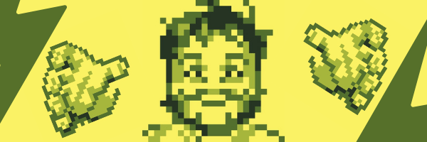

<h1 align="center">Hi 👋, I'm Juan Luis Palacios Pérez</h1>

<h3 align="center">A passionate frontend developer from Colombia</h3>

  

  

- 💬 Ask me about **React, Apprun**

<h3 align="left">Connect with me:</h3>

<h3 align="left">Languages and Tools:</h3>

                   

&nbsp;

